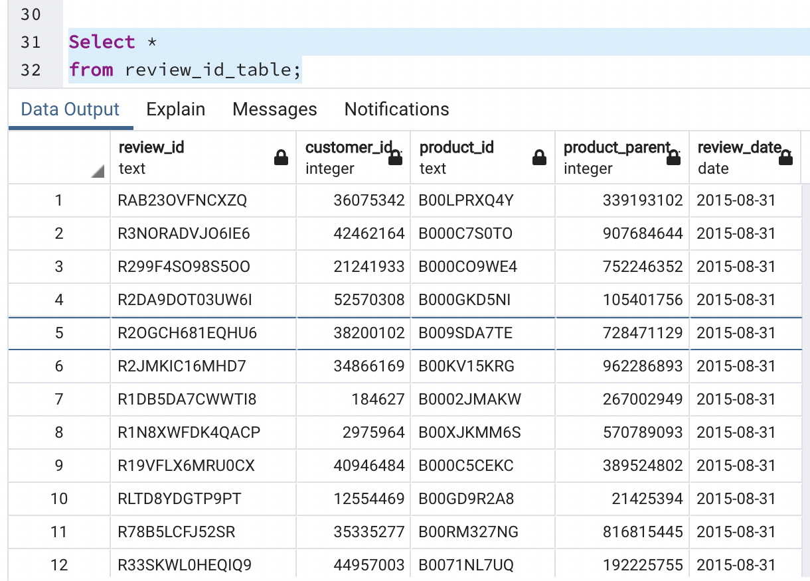
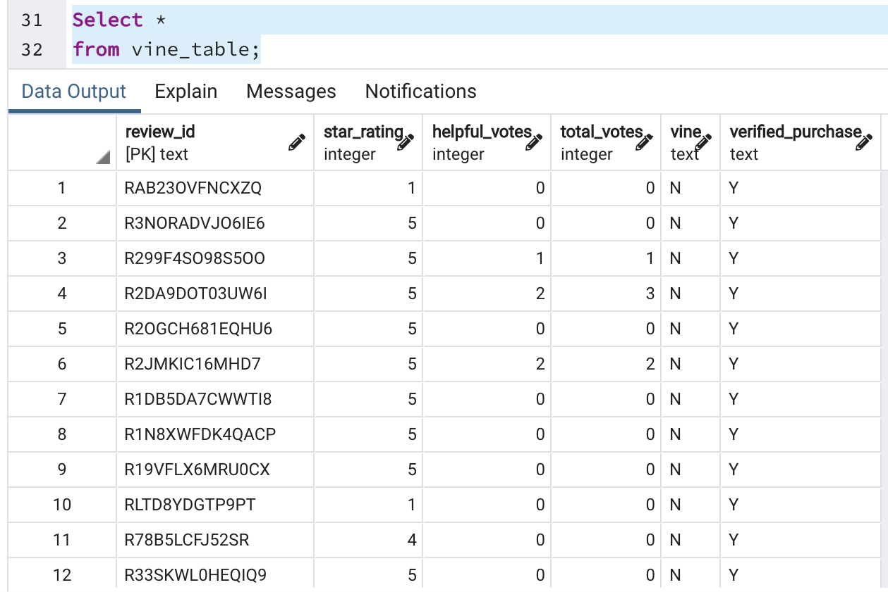

# Amazon Vine Analysis

**Analyzing Amazon Product Reviews in the Automotive Section for Bias**
The "Amazon Vine Analysis" project focuses on analyzing product reviews within Amazon's Automotive section to determine if there is any bias in the review system. The project uses a combination of cloud-based ETL (Extract, Transform, Load) processes, data visualization, and statistical analysis to achieve its goals.

## Resources
- [Amazon Reviews ETL Notebook](Amazon_reviews_ETL.ipynb)
- [Vine Reviews ETL Notebook](Vine_reviews_ETL.ipynb)
- [Download Raw Data](https://s3.amazonaws.com/amazon-reviews-pds/tsv/amazon_reviews_us_Automotive_v1_00.tsv.gz)

### Tools Used
- Python (Google Colab)
- Apache Spark
- pgAdmin
- PostgreSQL
- PySpark

## Project Overview

In this project, I utilized cloud-based ETL (Extract, Transform, Load) processes to analyze Amazon product reviews within the Automotive section. The primary objective was to determine if there was any bias in the reviews. Here's an overview of the steps taken:

1. **Data Extraction and Transformation:** I used my knowledge of cloud ETL processes to create an AWS RDS database with tables in pgAdmin. Spark played a crucial role in creating multiple dataframes, similar to the one displayed above, to facilitate data transformation into a more reader-friendly format.

2. **Data Upload:** Once the data was transformed, I uploaded it into the appropriate tables within the AWS RDS database.

3. **Data Validation:** I ran queries in pgAdmin to confirm that the transformed data had been successfully uploaded and was ready for analysis.

4. **Analysis:** The Amazon Vine program, a service that allows manufacturers and publishers to receive reviews for their products, was the focus of this analysis. The data was split to show the different amounts of Vine and non-Vine reviews, helping us identify any potential bias in the review system.

## Results

### How many Vine reviews and non-Vine reviews were there?
- The total number of reviews was:
  - Paid (Vine): 82
  - Unpaid (Non-Vine): 24,742

### How many Vine reviews were 5 stars? How many non-Vine reviews were 5 stars?
- The total number of 5-star reviews were:
  - Paid (Vine): 33
  - Unpaid (Non-Vine): 12,807

### What percentage of Vine reviews were 5 stars? What percentage of non-vine reviews were 5 stars?
- The percentage of 5-star reviews was:
  - Paid (Vine): 0.40%
  - Unpaid (Non-Vine): 0.52%

These results provide insights into the distribution of reviews in the Automotive section, helping to identify potential biases in the Amazon Vine program.

## Summary:
The initial ETL process wasn't too hard as the data came in an easy-to-use format. After transferring the clean table to Postgresql, the vine data can be split to show the difference between the reviews. When looking at the first two results, there is a massive domination of unpaid reviews as opposed to paid ones. This also translates to the 5-star reviews, with only 33 five stars. In the last section of the reviews, the percentage of 5 stars shows the bias towards unpaid reviews. This is hard to conclude as there is very little data in the paid category compared to the unpaid category.

The analysis reveals important insights, including the total number of Vine and non-Vine reviews, the number of 5-star reviews in each category, and the percentage of 5-star reviews. These findings provide valuable information about the distribution of reviews and any potential biases in the Amazon Vine program. This project serves as a valuable resource for anyone interested in understanding how reviews are distributed in the Automotive section of Amazon and whether there is any bias in the review system.
